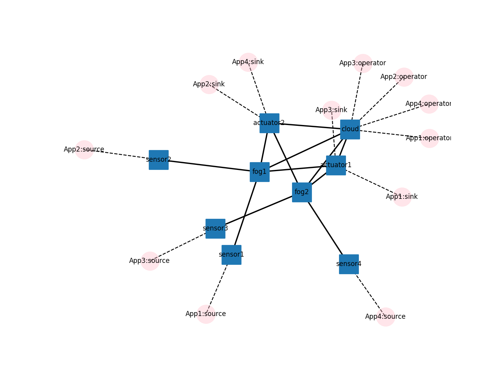
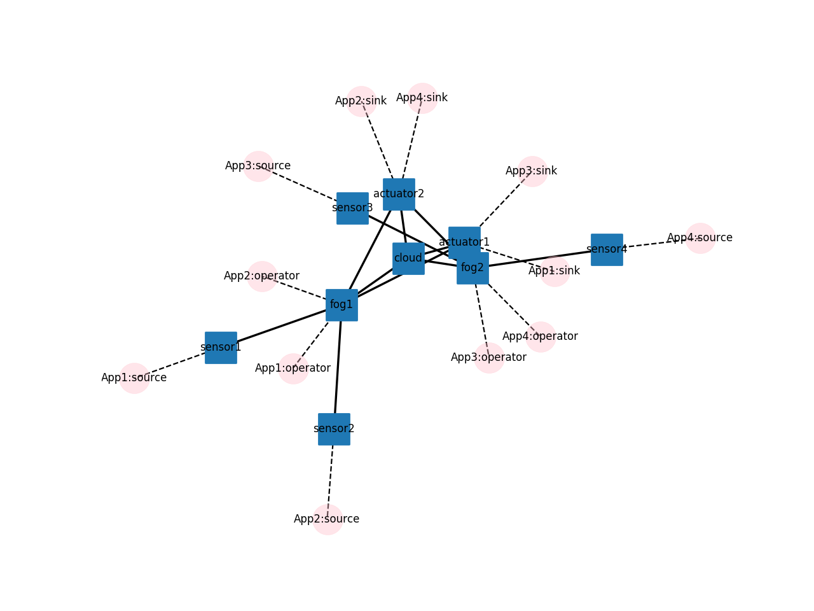

# pyFogSim

First dirty experiment

## CloudPlacement


```
Simulation Time:      10000
Real Time:            0.858 seconds
Messages transmitted: 2854
Bytes transmitted:    1499300

Average message time:  20.361
- network queue:       6.635
- network latency:     13.219
- operator queue:      0.007
- operator processing: 0.500
```


## EdgePlacement


```
Simulation Time:      10000
Real Time:            0.762 seconds
Messages transmitted: 2858
Bytes transmitted:    1501400

Average message time:  10.565
- network queue:       0.178
- network latency:     7.215
- operator queue:      0.172
- operator processing: 3.000
```