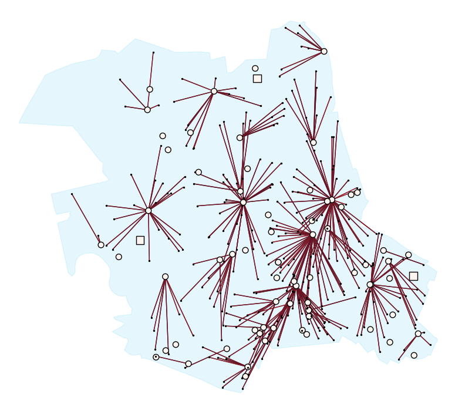

# pyFogSim

## 10 Sensors

| CloudPlacement load       | EdgePlacement load
|:-------------------------:|:-------------------------:
 | 

## 100 Sensors

| CloudPlacement load       | EdgePlacement load
|:-------------------------:|:-------------------------:
 | 

## 300 Sensors

| CloudPlacement load       | EdgePlacement load
|:-------------------------:|:-------------------------:
 | 
